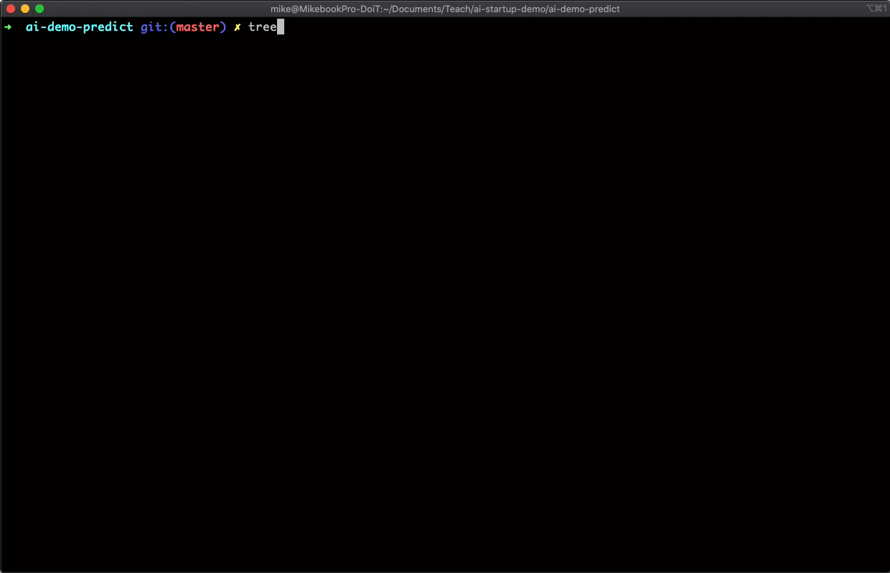

# AI Demo API (batch note review)
This API views batch predictions submitted by [ingest API](https://github.com/mikesparr/ai-demo-ingest) and allows the user to submit feedback, or corrections, to predictions to trigger model retraining jobs. This is 
created for demo purposes using [go-chi](https://github.com/go-chi/chi) HTTP framework for Golang.

# Demo (prediction, feedback, and retrain job)


# Architecture


# Components
- [Config](https://#) (pending)
- [Web App](https://#) (pending)
- [Ingest API](https://github.com/mikesparr/ai-demo-ingest)
- [Predict API](https://github.com/mikesparr/ai-demo-predict) (this repo)
- [Processors](https://github.com/mikesparr/ai-demo-functions)

# Prerequisites
You must be familiar with Google Cloud Platform and have the [Google Cloud SDK](https://cloud.google.com/sdk/docs/install) (`gcloud` CLI) installed. 
If you want to recreate the **AI Demo** then you will want an active project with billing enabled.

* NOTE: when you are done remember to **DELETE THE PROJECT** to avoid unneccessary billing.

# Install
The demo publishes a Docker image to container registry and deploys the app to Cloud Run. 
These are the steps to recreate this in your own environment.

```bash
export PROJECT_ID=$(gcloud config get-value project)
export TOPIC_ID="feedback"
export GCP_REGION="us-central1"
export VPC_CONN_NAME="serverless-connector" # needed to bridge networks

# create pubsub topics
gcloud pubsub topics create $TOPIC_ID

# create pubsub subscriptions
gcloud pubsub subscriptions create feedback-sub --topic $TOPIC_ID

# enable services
gcloud services enable compute.googleapis.com \
    run.googleapis.com \
    redis.googleapis.com \
    cloudbuild.googleapis.com

# fetch cache (memorystore: redis w/ vpc connector) info
# assume cache and vpc connector already created with backend processors
export REDIS_HOST=$(gcloud redis instances describe ml-cache1 --region us-central1 --format="value(host)")
export REDIS_PORT=$(gcloud redis instances describe ml-cache1 --region us-central1 --format="value(port)")
export AUTH_NETWORK=$(gcloud redis instances describe ml-cache1 --region us-central1 --format="value(authorizedNetwork)")
echo "Redis instance at ${REDIS_HOST}:${REDIS_PORT} on network ${AUTH_NETWORK}"

# clone repo and change to directory
git clone git@github.com:mikesparr/ai-demo-predict.git
cd ai-demo-predict

# build the api image
gcloud builds submit --tag gcr.io/${PROJECT_ID}/ai-demo-predict

# deploy the api to cloud run
gcloud run deploy ai-demo-predict \
    --image gcr.io/${PROJECT_ID}/ai-demo-predict \
    --region $GCP_REGION \
    --allow-unauthenticated \
    --platform managed \
    --vpc-connector $VPC_CONN_NAME \
    --update-env-vars PROJECT_ID=$PROJECT_ID,TOPIC_ID=$TOPIC_ID,REDISHOST=$REDIS_HOST,REDISPORT=$REDIS_PORT
```

# Usage
Once deployed, you can fetch the `$PREDICT_URL` from Cloud Run and `GET` or `PATCH` data to the API. For updates, since it just publishes data to a Pub/Sub topic, you will just receive either the submitted record, or error message.

```bash
# get URL of service
export PREDICT_URL=$(gcloud run services describe ai-demo-predict --format="value(status.url)" --platform managed --region $GCP_REGION)

# test the API
# view batches
curl $PREDICT_URL/batches
# view jobs
curl $PREDICT_URL/jobs
# submit batch corrections (feedback for retraining)
curl -XPATCH $PREDICT_URL/batches/f913f035-431a-11eb-b467-b9171009f67c \
    -H "Content-Type: application/json" \
    -d '{"subjects":["miketest-6"],"ratings":[1]}'
```

# Spec
See the OAS2/Swagger specification `config.yaml` for more details

# Other considerations
Although this is only a demo, a few additional features that should be added would be:
- automated tests
- standardized Request / Response
- pagination
- retry logic with exponential backoff
- tracing using [opentracing](https://opentracing.io/)
- messages using [cloudevents](https://cloudevents.io/)

# Contributing
This is just a demo so fork and use at your own discretion.